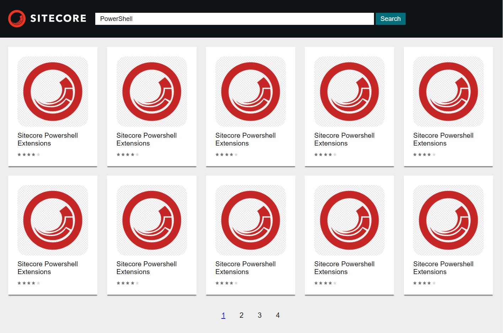
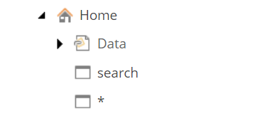

# Sitecore Marketplace Website

## Prerequisites

* Install [Sitecore 9.3 (Initial Release)](https://dev.sitecore.net/Downloads/Sitecore_Experience_Platform/93/Sitecore_Experience_Platform_93_Initial_Release.aspx)
* Install SXA 9.3

* Deploy Solution using **build.ps1** 
script

* Create both SXA Tenant and SXA Site like below:

* Install our custom SXA Modules:

## Site Appearance

* `Landing Page` with `Search Bar` and **most popular modules' categories**

* `Search Results Page`

* `Module Details Page`

## Site Structure

* `Easy to maintain`

A few page items allow us to maintain all logic for Featured Modules sections, Search results and Modules details. Sitecore wildcard feature help us to use one page for every model's details.

* `Wise storage`

Modules could be added by content editor and will be stored as bucketable item. The Search Index will use the data for search page and category block on pages.

